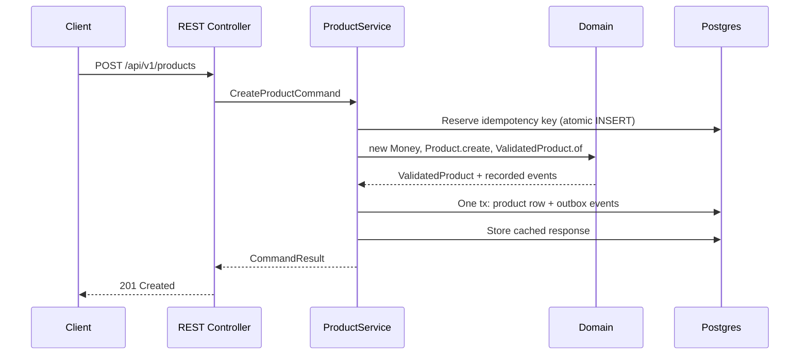

# Architecture reference

The one-page version of the rules the tutorial builds up. If you're evaluating the template or reviewing a change against its conventions, this is the page to keep open — and the layer rules on it aren't left to review: a test enforces them.

## The onion


Dependencies point **inward only**. The domain sits at the center and imports nothing from the layers around it.

```
com/example/marketplace/
├── domain/           # entities, value objects, events, repository INTERFACES
├── application/      # commands, queries, services (orchestration)
├── infrastructure/   # JDBC repositories, outbox relay, JSON, database config
├── interfaces/       # REST controllers, DTOs
└── bootstrap/        # wiring: the only place that knows every layer
```

| Layer | May import | Must never import |
|---|---|---|
| `domain` | the JDK, the UUID generator | application, infrastructure, interfaces, any framework or driver |
| `application` | domain, SLF4J | infrastructure, interfaces, Spring, Jackson, JDBC |
| `infrastructure` | domain, application | interfaces |
| `interfaces` | application, domain (types only) | infrastructure |
| `bootstrap` | domain, application | infrastructure, interfaces |

## How the table is enforced

Two mechanisms, one for each kind of rule.

**Access modifiers.** Everything is package-private by default; a type is `public` only when another package must use it. The infrastructure and interfaces layers have **no public classes at all** — their repositories, controllers, and filters are Spring components found by component scanning. Nothing can import them, because there is nothing to import.

**[`ModuleStructureTest`](https://github.com/<owner>/java-ddd/blob/main/src/test/java/com/example/marketplace/ModuleStructureTest.java).** Access modifiers can't stop the domain from importing application's public records, or the domain from importing Spring. So each layer package declares its allowed dependencies with [Spring Modulith](https://docs.spring.io/spring-modulith/reference/) in a `package-info.java`:

```java
@ApplicationModule(type = ApplicationModule.Type.OPEN, allowedDependencies = {})
package com.example.marketplace.domain;

import org.springframework.modulith.ApplicationModule;
```

`ApplicationModules.of(MarketplaceApplication.class).verify()` then fails the build on a cycle or on any dependency a layer didn't declare. Modulith only looks at dependencies between your own packages, so the same test adds an ArchUnit allowlist for the libraries the two inner layers may use:

```java
classes().that().resideInAPackage("com.example.marketplace.domain..")
        .and().doNotHaveSimpleName("package-info")
        .should().onlyDependOnClassesThat().resideInAnyPackage(
                "java..",
                "com.fasterxml.uuid..",
                "com.example.marketplace.domain..")
        .check(MAIN_CLASSES);
```

The one accepted exception is the Modulith annotation in each `package-info.java`: it's metadata about the package, not code the domain runs, and the allowlist skips it. The domain and application modules are declared `OPEN` because their public types live in subpackages (`domain.entities`, `application.command`, …), which Modulith otherwise treats as private.

The wiring point where everything meets is [`bootstrap/ApplicationWiring.java`](https://github.com/<owner>/java-ddd/blob/main/src/main/java/com/example/marketplace/bootstrap/ApplicationWiring.java): the application layer carries no Spring annotations, so its services become beans there, built from the repositories and codec that infrastructure contributes by type through component scanning. No other class knows all the layers.

## Layer responsibilities

**Domain** ([tutorial 1](../tutorial/01-the-domain.md)–[4](../tutorial/04-aggregates.md)) — the model. Entities enforce their invariants via factories and `validate()`; value objects like `Money` are unconstructible in invalid states; aggregates reference each other by Id only; repository *interfaces* declare what persistence the model needs. Errors are a sealed exception hierarchy (`ValidationException`, `ProductNotFoundException`, `SellerNotFoundException`) that outer layers translate.

**Application** ([tutorial 6](../tutorial/06-cqrs.md), [8](../tutorial/08-idempotency.md)) — the use cases. Commands and queries as explicit records; services orchestrate (load aggregates, invoke domain behavior, persist) but never decide business rules; the `withIdempotency` wrapper makes every command retry-safe. Results are output shapes, not entities.

**Infrastructure** ([tutorial 5](../tutorial/05-repositories.md), [7](../tutorial/07-domain-events-outbox.md)) — the details. Hand-written SQL through `JdbcClient` behind the domain's repository interfaces; row-to-entity mapping routes through validating constructors; the aggregate write and its outbox events share one transaction; the relay polls and publishes with at-least-once semantics.

**Interfaces** — the edge. Spring MVC controllers bind DTOs, call services, and map domain and application exceptions to status codes in [`RestErrors.java`](https://github.com/<owner>/java-ddd/blob/main/src/main/java/com/example/marketplace/interfaces/api/rest/RestErrors.java): `ProductNotFoundException` → 404, `ValidationException` → 400, `RequestInFlightException` → 409, `IdempotencyKeyReuseException` → 422. DTOs use explicit primitives (`price_minor_units`, not `price`) so the wire format can never be ambiguous.

## The request flows

Write path:



Read path: controller → query → service → repository → result mapping. No entity construction ceremony, no idempotency, no events — reads have no business rules.

Event path: outbox relay polls `outbox_events WHERE published_at IS NULL` (partial index), hands each to a `Publisher`, marks published. At-least-once; consumers deduplicate on the UUIDv7 event Id.

## Conventions that keep the codebase consistent

- **Factories everywhere.** Private constructors and a static `create(...)` for every entity; `reconstitute(...)` is reserved for repositories loading stored rows. Records with validating canonical constructors for value objects.
- **`ValidatedX` types at trust boundaries.** Repository write methods accept only validated types — the compiler enforces the validation contract.
- **Exceptions by type.** Domain errors are a sealed hierarchy, matched by type (`switch` patterns in `RestErrors`); never branch on message strings.
- **Package-private by default.** A type is `public` only when another package needs it; the outer layers have no public types at all.
- **Soft deletes.** `deleted_at` columns; every read query filters `deleted_at IS NULL`. Deleted data is invisible, not gone.
- **Migrations are forward-only.** Schema evolves through numbered Flyway migrations in `src/main/resources/db/migration/` (`V<N>__description.sql`); to undo a change, write a new migration.
- **Defaults live where the invariant lives.** Business defaults belong in domain code, not split between code and DB where they can drift.

## Tooling map

| Concern | Tool | Where |
|---|---|---|
| HTTP | Spring MVC (Spring Boot 4) | `interfaces/api/rest/` |
| DB access | `JdbcClient`, PostgreSQL JDBC, HikariCP | `infrastructure/db/postgres/` |
| Migrations | Flyway | `src/main/resources/db/migration/` |
| JSON | Jackson 3 | `infrastructure/json/`, `interfaces/api/rest/JsonStrictnessConfiguration.java` |
| Logging | SLF4J / Logback | throughout (not in the domain) |
| Tests | JUnit 5, AssertJ, Testcontainers | `src/test/java/`, `testhelpers/PostgresTestContainer.java` |
| Layer rules | Spring Modulith + ArchUnit | `ModuleStructureTest` |
| API contract | OpenAPI 3, black-box contract suite | `api/openapi.yaml`, `contract-tests/` |
| Ops probes | `/healthz`, `/readyz` | `interfaces/api/rest/HealthController.java` |

For the reasoning behind each of these decisions, the [tutorial](../tutorial/01-the-domain.md) walks them in order; for the trade-offs, the [FAQ](faq.md).
